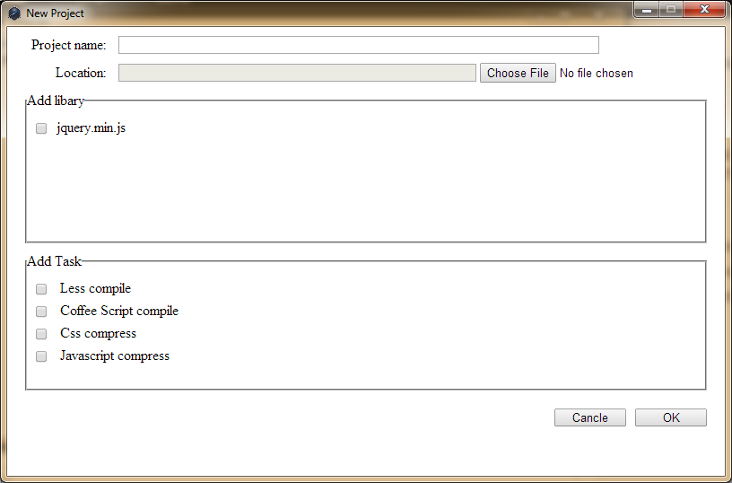
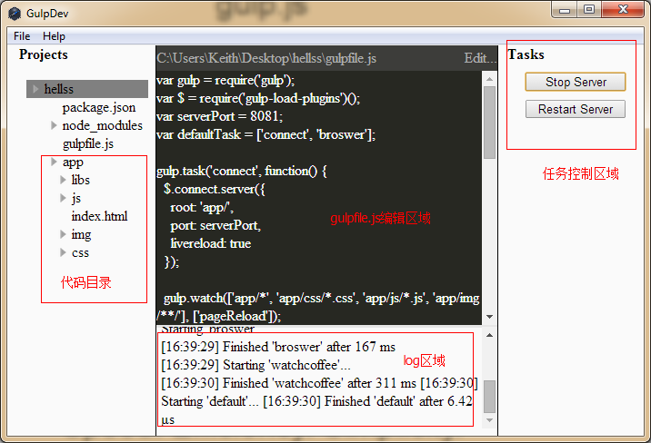

# Node-webkit应用Demo

GulpIDE
=======

##项目介绍

这是整合了[livereload功能](http://lufeng.me/post/livereload)的GUI程序，用于前端开发的预处理task runner，如果你用过grunt,可以理解为是grunt的图形界面程序，实际是使用[gulpjs]()，gulpjs和grunt一样，也是一个task runner，但gulp是基于流的操作，比grunt更高效、更简洁。

项目使用node-webkit构建，下载地址[http://pan.baidu.com/s/1dDzSLZb](http://pan.baidu.com/s/1dDzSLZb)。

##软件功能

- 新建项目
	- 选择项目所需的库文件直接拷贝到新项目目录下
	- 选择预处理项，默认支持livereload, 目前可选less编译, coffee script编译， js压缩，css压缩。
- 添加已有项目
	- 对于原来不是gulp项目的新项目，程序会将其转换为gulp项目，然后根据自己项目的目录结构修改gulpfile.js
- 编辑项目配置文件(gulpfile.js)

## 构建过程

- 新建项目
	1. 建立项目目录，拷贝livereload所需的node_modules到项目目录下
	2. 如果新建项目时选择了task(less, coffee, cssmin, uglify)将会下载node_module
	3. 在项目目录下建立app文件夹，这是你的代码的放置位置
	4. 如果新建项目时选择了libs，拷贝相应文件/文件夹到新项目app目录下的libs文件夹中
	5. 新建完成后加载gulpfile.js到编辑区
	
- 添加项目
	1. 检测项目目录下是否存在gulpfile.js，
		- 有则直接加载gulpfile.js到编辑区
		- 没有则将你的项目拷贝到一个临时文件夹下，然后同新建项目过程相同
			- 新建完成后将临时文件夹的内容移动到新建项目的app文件夹下

##开始使用
1. 此软件依赖于[Node.js](http://nodejs.org)，npm包管理器，npm第三方包[gulp.js](http://gulpjs.com/)，请先安装以上依赖程序，此应用才可正常运行。
2. 如果第一步中的依赖程序都已经安装，[下载](http://pan.baidu.com/s/1dDzSLZb)此程序并解压文件.
2. 运行Gulp IDE.exe
3. file-->new project

填写项目名称，选择项目位置，勾选所需库文件、任务流，OK，请耐心等待安装npm modules.
4. 配置gulpfile.js，应用中间区域为gulp配置文件gulpfils.js编辑区，左侧Projects目录为项目目录树，右侧Tasts为gulp任务控制区域，下方是gulp执行日志

5. `Start Server`开始运行，此时会以app文件夹为根目录，开启一个浏览器访问程序页面，当app目录下代码文件发生改变时，浏览器会自动刷新。
6. 如果程序出现异常，不能开启浏览器访问，需要根据log修改配置文件，多数可能是gulp配置的默认server端口被占用，请根据情况自行配置gulp任务，安装其他gulp插件。
7. 打开已有项目，程序会根据目录下是否存在gulpfile.js文件判断项目是否为gulp项目，是就直接打开，不是的话则建立gulp项目目录结构，将原项目程序全部移动至app文件下，只配置基本的liverelod任务，之后过程与新建项目相同。

##注意事项

- 你需要熟悉gulp的基本使用及配置
- 你的程序代码因该全部在项目目录的app文件夹下
- asset文件夹下的libs目录用于存放库文件，可以把自己常用的库文件放在这，新建项目时选择需要的库文件，会将其拷贝到新项目目录下
- asset下的template目录package.json和gulpfile.js不建议修改（除非你比较熟悉gulpjs），其他的文件可以自行替换
- asset下的node_module目录不可修改移动，里面是构建livereload功能的基本模块，并且都是指定版本
